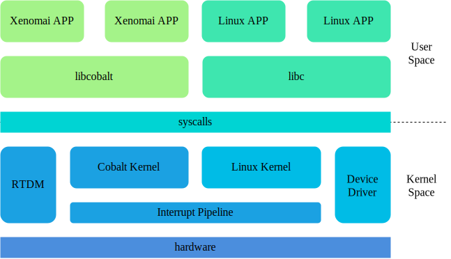
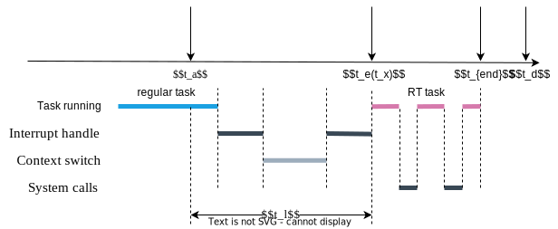
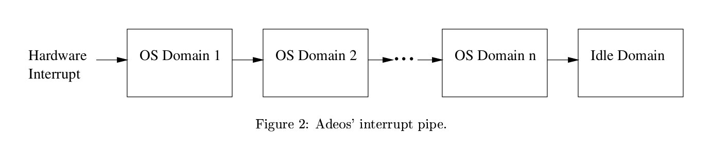
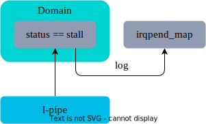
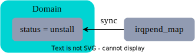

## 用户视角的 Xenomai

libcobalt 为应用程序提供实时API，兼容POSIX，Vxworks等

---

## 实时任务运行模型

实时任务要求在截止时间$t_d$前对$t_a$时刻到达的外部事件处理完毕

### 实时系统的评价指标

- $t_l$：通常认为$t_l$越小实时性越好
- 多次测量$t_l$的范围（抖动）：通常认为范围越小，稳定性越好

---

## 内核视角的 Xenomai

---
### 中断虚拟化

将CSR标记位和物理中断状态放入内存

某些情况下只关闭虚拟中断，打开物理中断，从而缩短了中断的响应时间

### 实时内核 cobalt
- 专为实时任务服务的调度器，调度实体`xnthread` + `task_struct`
	- 实时任务得到更多的调度机会
- 实时系统调用`syscall_nr & __COBALT_SYSCALL_BIT`
	- 实时系统调用路径较短
	- 避免了潜在的调度

---

## 优化

运行环境为4核3A5000+7A2000平台，访存负载为`stress -m 4`

### 内核配置

Xenomai希望关闭 `PAGE_MIGRATION->CMA, TRANSPARENT_HUGE_PAGE`，当关闭了 `TRANSPARENT_HUGE_PAGE` 后，在访存负载下的平均延迟显著降低：

|负载类型|最低延迟（$\mu \text{s}$）|最高延迟（$\mu \text{s}$）|平均延迟（$\mu \text{s}$）|关闭透明巨页|
|:---:|:---:|:---:|:---:|:---:|
|无|-0.153|18.696|0.404|未关闭|
|无|-0.075|17.749|0.513|关闭|
|访存|0.340|120.541|9.890|未关闭|
|访存|-0.032|129.712|2.485|关闭|

